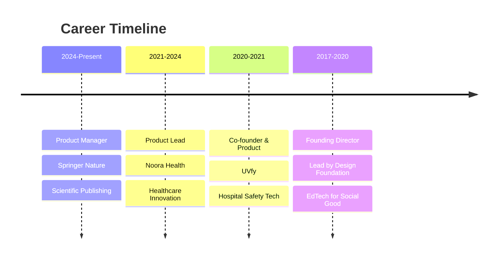

<div align="center">


<br>

[](https://www.shreyasprakash.com)
[](https://twitter.com/shreyasmakes)
[](https://linkedin.com/in/shreyasprakash)

<br><br>

</div>

---

## About

> *"Writing is thinking. Creating is living. Building is hoping."*

Product Manager who believes in building things that are **positive sum and impactful**. I like trying to understand the world, creating things that improve it, and sharing knowledge freely on the Internet.

**London** • **Product Manager at Springer Nature** • **Philosophy:** 10 years from now, or a 100, my writing might outlive me. This is my attempt at posterity.

## 🚀 What I'm Working On

### 🏢 Product Leadership
Currently improving the **author experience** in academic publishing - helping researchers navigate their submission and open access publication journey at Springer Nature.

### 🛠️ Open Source Contributions
Building tools and experiments that solve real problems:

- 🏆 **[Chess Coach](https://chesscoach-one.vercel.app/)** - AI-powered chess improvement tool
- ✍️ **[writing.humans](https://github.com/shreyas-makes/writing.humans)** - AI writing tool for 100% human writing
- 📝 **[Edit Next](https://github.com/shreyas-makes/editnext-plugin)** - Obsidian plugin to tackle your worst drafts first
- 🎬 **[Magic Window](https://github.com/shreyas-makes/magic-window)** - Screen recorder with zoom effects
- 📚 **[Zotero Raycast](https://github.com/shreyas-makes/zotero-raycast)** - Cite research references super fast

## 💼 Professional Journey



## 🎯 Impact Areas

<table>
<tr>
<td align="center" width="25%">

<br><sub><b>Academic Publishing</b><br>Author Experience</sub>
</td>
<td align="center" width="25%">

<br><sub><b>Healthcare</b><br>Patient Prevention</sub>
</td>
<td align="center" width="25%">

<br><sub><b>Assistive Tech</b><br>Hospital Safety</sub>
</td>
<td align="center" width="25%">

<br><sub><b>EdTech</b><br>Social Innovation</sub>
</td>
</tr>
</table>

## 🧰 Tech Stack & Tools

### 🎨 AI-Assisted Development
```
🤖 Cursor IDE with Claude Sonnet for rapid prototyping
🧠 Building with AI assistance for humanitarian projects
⚡ Focus on shipping fast, impactful solutions
```

### 💻 Technologies


## 📊 GitHub Activity

<div align="center">
  


</div>

## 📝 Latest Blog Posts
<!-- BLOG-POST-LIST:START -->
- [Building Digital Products That Matter](https://www.shreyasprakash.com/posts/bdres/)
- [Preventing Hospital Infections with UVfy](https://www.shreyasprakash.com/posts/uvfy)
- [Empowering Children to Invent for Social Good](https://www.shreyasprakash.com/posts/dhive/)
<!-- BLOG-POST-LIST:END -->

## 🌟 Philosophy

<div align="center">
<i>"This digital garden contains thousands of words spread across essays, case studies, experiments, and book reviews. I write about what I'm building, what I'm learning, and the ideas I'm exploring."</i>
</div>

### 🎯 What Drives Me
- **🌱 Positive Sum Thinking** - Building things that create value for everyone
- **📚 Knowledge Sharing** - Making information freely accessible
- **🛠️ Practical Impact** - Turning ideas into real-world solutions
- **🤝 Humanitarian Focus** - Using technology for social good

## 📬 Let's Connect

<div align="center">

💌 **Open to collaborations on projects that make the world a little better**

[](mailto:your-email@example.com)
[](https://calendly.com/shreyasprakash)

---

<sub>⭐ If you find my work interesting, consider starring some repositories!</sub>

</div>


